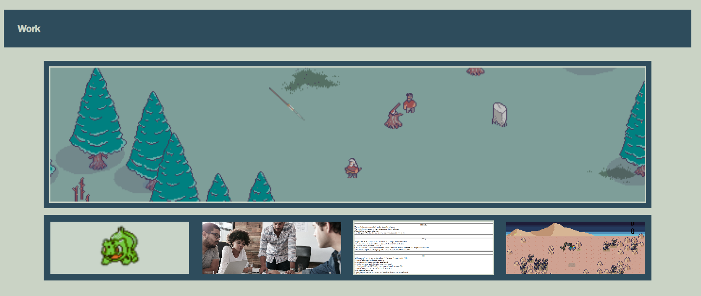

# professional-portolio

## Description

A collection of past coding and development work to act as a portfolio for potential employers.

Page can be veiwed at 
https://kingbgreen5.github.io/professional-portolio/

## Installation
N/A

## Usage

Click The links at the Navbar at the top to move around the site. Click the pictures in the "Work" Section to veiw deployed applications. 

=======

## Credits
Starter code provided by 
Justin Gottschalk

## License
MIT
